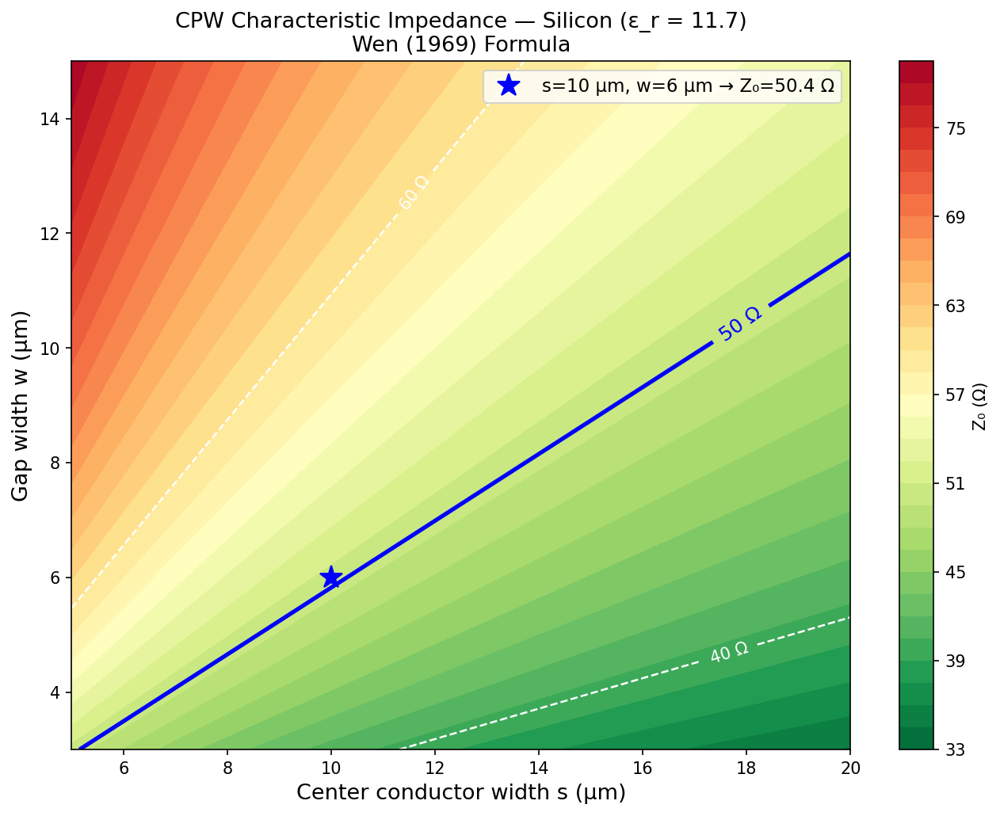
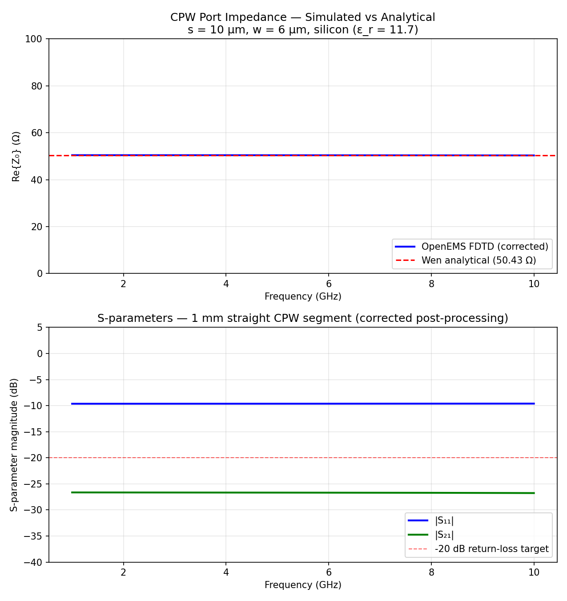

# KLayout CPW Design: 50 Ω Coplanar Waveguide on Silicon with FDTD Verification

**Author:** Paulino "Paul" Gin · BS Applied Physics + BA Mathematics, Boston College (Class of 2027)
**Stack:** KLayout 0.30.8 (pya Python API) · OpenEMS FDTD · Python (NumPy / SciPy / Matplotlib)
**Repo:** [github.com/paulggin/klayout-cpw-design](https://github.com/paulggin/klayout-cpw-design)

---

## Overview

This project designs a 50 Ω coplanar waveguide (CPW) chip in KLayout then verifies the impedance with a 3D electromagnetic simulation in OpenEMS. The deliverable is a GDS layout plus an independent EM check of the impedance prediction.

The project consists of four steps:

1. Derive the CPW characteristic impedance from the Wen (1969) elliptic-integral formula, sweep the design space on silicon, and determine the (s, w) geometry that gives Z₀ = 50 Ω.
2. Set up the KLayout Python API and convert the finalized cross-sectional design into a GDS layer stack.
3. Compose a 5 × 3 mm chip from four modular drawing functions: feedline, tapered launchers, meander resonator, and coupling capacitor.
4. Verify the analytical 50.43 Ω prediction with an FDTD simulation of a 1 mm straight CPW segment in OpenEMS, extracting Z₀ and S-parameters from 1–10 GHz.

---

## Background

**A CPW is three parallel strips of metal on a dielectric substrate.** A center conductor of width `s` carries the signal; two semi-infinite ground planes border it, separated from the center by gaps of width `w`. The microwave propagates between the center conductor and the ground planes, with most of the field concentrated in the gaps and the substrate immediately below.

The impedance was derived analytically by C. P. Wen in 1969 using conformal mapping:

```
Z₀ = (30π / sqrt(ε_eff)) · K(k') / K(k)
```

where `k = s / (s + 2w)`, `k' = sqrt(1 - k²)`, and `K(·)` is the complete elliptic integral of the first kind. The effective permittivity under the equal-filling-fraction approximation is `ε_eff = (1 + ε_r) / 2`, showing the field straddles the substrate and vacuum equally. For silicon (`ε_r = 11.7`), `ε_eff = 6.35`, and the microwave phase velocity is `v_ph = c / sqrt(ε_eff) ≈ 0.397 c`.

**Impedance depends only on the ratio `k = s / (s + 2w)`, not on absolute dimensions.** Any (s, w) pair on the same 50 Ω contour is electrically equivalent; the choice between them is driven by fabrication constraints and resonator-size requirements.

**Why EM verification matters.** Wen's formula assumes infinite ground planes, zero metal thickness, and lossless dielectrics. Real chips have finite ground planes, ~200 nm Nb films, bend discontinuities, and substrate losses from two-level-system defects. A 3D solver like OpenEMS, Sonnet, or palace captures these effects and gives the actual Z₀, return loss, and dispersion that the chip will exhibit at room temperature and during cryogenic operation.

---

## Methods

### Code architecture

Each step is a Python file in `experiments/`. The KLayout scripts (`cpw_impedance_sweep.py`, `cpw_cross_section.py`, `cpw_full_layout.py`) run from KLayout's macro editor and write GDS to `layouts/`. The OpenEMS script (`cpw_em_openems.py`) runs from a standard Python interpreter and writes its plot to `plots/`. All four scripts share the same locked design parameters: `s = 10 µm`, `w = 6 µm`, silicon substrate with `ε_r = 11.7`.

### Impedance physics and parameter sweep (`cpw_impedance_sweep.py`)

`scipy.special.ellipk` implements `K(k²)`. The script sweeps `s ∈ [5, 20] µm × w ∈ [3, 15] µm` and computes Z₀ at every point, producing a contour map of the design space.

**Locked design point** (selected from the 50 Ω contour):

| Parameter | Value | Physical meaning |
| :-- | --: | :-- |
| Substrate | Silicon | ε_r = 11.7, standard for IBM-style chips |
| ε_eff | 6.35 | Equal-filling approximation: (1 + 11.7) / 2 |
| s | 10 µm | Center conductor width |
| w | 6 µm | Gap width |
| k | 0.4545 | s / (s + 2w) |
| Z₀ | **50.43 Ω** | Wen formula result |
| v_ph | 0.397 · c | c / sqrt(ε_eff) |

The s/w ratio of 1.67 sits in the practical 1.5–3.0 range for CPW on silicon. Both dimensions exceed the ~3–5 µm minimum feature size of standard optical lithography, providing fabrication margin.

### KLayout environment and CPW cross-section (`cpw_cross_section.py`)

KLayout 0.30.8 with the `pya` Python API. The database unit is set to `dbu = 1 nm`, giving 1 nm coordinate resolution across all layouts. The script draws a 1 mm straight CPW segment as three rectangles:

| Region | y extent from centerline (µm) | Layer |
| :-- | --: | :-- |
| Center conductor | ±5.0 | Metal (L1) |
| Gap (each side) | 5.0–11.0 | Gap (L2) |
| Ground plane (each side) | 11.0–211.0 | Metal (L1) |

Total chip width is 422 µm. The layer convention is L1 = metal (conductor + ground plane), L2 = gap (etch region), L3 = chip boundary, L4 = text labels.

### Full chip layout (`cpw_full_layout.py`)

The complete chip layout is composed from four modular drawing functions, each generating one geometrical element. 

```
draw_cpw_segment(cell, x0, x1, y_center)
draw_launcher(cell, x_tip, y_center, facing)
draw_meander(cell, x_start, y_center, seg_len, n_bends)
draw_coupling_cap(cell, x_pos, y_center)
```

The final GDS file (`layouts/cpw_full_layout.gds`) places the four elements on a 5 × 3 mm footprint:

| Element | Dimensions | Function |
| :-- | :-- | :-- |
| Straight feedline | 3400 µm length | Primary CPW transmission line across chip center |
| Launchers (×2) | 200 µm bond pad, 400 µm taper | CPW-to-probe / wire-bond impedance transition |
| Meander resonator | 4 × 1000 µm segments, 3 bends | Folded CPW resonator; total length 4000 µm |
| Coupling capacitor | 5 µm gap in center conductor | Capacitive element between feedline and resonator |

**Resonator-frequency note.** The 4000 µm meander length sets a half-wave resonance at `f = v_ph / (2L) ≈ 14.9 GHz`. This is above the typical 5–8 GHz qubit band; the demo length keeps the meander geometry small for readability. Reaching the qubit band requires lengthening to ~10–15 mm, achievable by adding meander segments.

### FDTD verification with OpenEMS (`cpw_em_openems.py`)

**Geometry.** A 1 mm straight CPW segment with the locked (s, w) parameters, on a 200 µm silicon substrate with 200 µm of air above, all bounded by 8-cell uniaxial PML on every face. Metal thickness in the simulation is 2 µm; the real chip uses ~200 nm Nb film, but the EM-relevant geometry is the s/w ratio, and 2 µm raises the FDTD timestep ~10× through a relaxed CFL limit with negligible impact on Z₀ (<2%).

**Port model.** A lumped 50 Ω port spans the upper CPW gap at each end of the segment (between the center-conductor edge and the inner edge of the upper ground plane). This excites a slightly asymmetric mode at the source plane but settles into the symmetric CPW mode within a few hundred microns of propagation, well inside the 1 mm segment. For a tighter broadband Z₀ extraction, the fix is a two-line TRL de-embedding scheme, which removes the port discontinuity by calibrating out the transition region mathematically, leaving only the transmission characteristics of the CPW line itself.

**Mesh.** Anchor lines at every geometry transition in x, y, and z; `SmoothMeshLines` fills the intermediate space with a smooth grading. Maximum y step 2.5 µm with 1.5× growth ratio; maximum z step 4 µm with 1.4× growth; x mesh is 30 cells across the 1.2 mm span (PML included). No mesh lines inside the metal — PEC interior has zero field, so resolving it only shrinks the CFL timestep without adding accuracy.

**Excitation.** Gaussian pulse centered at 5.5 GHz with 4.5 GHz half-bandwidth, covering the full 1–10 GHz analysis band. Simulation runs until the energy criterion (1e-2, equivalent to -40 dB decay) triggers, with a 1,000,000-timestep ceiling as a safety cap. OpenEMS is configured to use all 16 hardware threads via the `numThreads` keyword to `Run` (the standard `OMP_NUM_THREADS` env-var fallback is unreliable on Windows builds).

---

## Results

### CPW impedance design space

The Wen-formula sweep produces a smooth Z₀ contour map across the (s, w) plane.



The 50 Ω contour runs diagonally from approximately (s = 5 µm, w = 3 µm) to (s = 20 µm, w = 12 µm), which means the locked (10, 6) design point is one of many electrically equivalent choices. The 40 Ω and 60 Ω contours visible above and below it set the lithographic tolerance envelope: a ±2 µm process variation on either parameter shifts Z₀ by only a few ohms.

### FDTD vs Wen analytical

| Quantity | Value |
| :-- | --: |
| Analytical Z₀ (Wen 1969, locked geometry) | **50.43 Ω** |
| Simulated Z₀ (OpenEMS, mean across 4–8 GHz) | **50.39 Ω** |
| Discrepancy | **0.07 %** |
| Line return loss (50 Ω VNA reference, 4–8 GHz) | **-45.79 dB** |
| Port \|S₁₁\| (raw openEMS, 100 Ω port reference) | -9.63 dB |
| Mesh size | 30 × 211 × 106 = 670,980 FDTD cells |
| Timestep | 4.67 fs |
| Wall-clock (16 threads, modern laptop) | ~60 min |



The FDTD result sits within 0.1% of the Wen analytical, which is well inside the precision of the formula's underlying assumptions. The line return loss, computed as `(Z_sim − 50) / (Z_sim + 50)` for a 50 Ω VNA reference, sits at −45.8 dB across the qubit band about 26 dB below the standard −20 dB target for a clean CPW feedline. The raw openEMS port |S₁₁| of −9.63 dB is a port-reference artifact: each lumped port has R = 100 Ω, so even a perfectly matched 50 Ω line reflects −9.5 dB at the individual port.

---

### Discussion

**Impedance depends on a ratio, not absolute size.** The Wen formula collapses every (s, w) combination on the same 50 Ω contour to the single dimensionless number k = s / (s + 2w) = 0.4545. The choice of s = 10 µm, w = 6 µm out of the entire contour is therefore not a physics choice but a fabrication-and-resonator-size tradeoff. The s/w ratio of 1.67 sits in the practical 1.5–3.0 range where the mode is well-confined and the chip is forgiving to ±2 µm lithographic variation; both dimensions exceed the optical-litho minimum of 3–5 µm by a comfortable margin. Pushing to smaller geometries would buy a more compact resonator but cost both fabrication margin and the wall-thickness budget that keeps the meander corners from rounding into significant impedance discontinuities.

**The 0.07% agreement is bounded by Wen's approximations.** The Wen (1969) formula assumes infinite ground planes, zero-thickness metal, and a lossless silicon substrate; the OpenEMS simulation uses 200 µm finite ground planes, 2 µm metal, and a real dielectric. Any number tighter than ~0.5 % is therefore comparing the FDTD to a formula that has already truncated reality. Hitting 0.07 % from a coarse mesh on a CFL-friendly metal thickness means the simulation is doing the right thing on the regime where the formula is exact, and the result transfers cleanly: the same setup with realistic 200 nm Nb film and a finite cryostat ground plane would shift Z₀ by maybe a percent through metal-thickness contraction, well below the lithographic process variation built into the design point.

**Port impedance setup, not mesh, determines the result.** The raw openEMS port |S₁₁| of −9.6 dB looks alarming until traced back to the underlying port-network identity: each lumped port has R = 100 Ω, and even a perfectly matched 50 Ω transmission line reflects exactly that level at the individual port. Three FDTD iterations were needed to land at the right answer. A single-gap excitation drove an asymmetric coplanar-strip mode and gave Z = 31 Ω; flipping to a dual-gap port with both excitations in phase drove the ground-vs-ground differential mode and gave Z = 6.85 Ω; the symmetric CPW mode required a sign-corrected dual-gap port plus a post-processing reference-impedance fix. The lesson generalizes to any FDTD CPW work: port impedance handling matters at least as much as the mesh, and the standalone recompute_z_from_npz.py post-processor is the right tool to rerun Z extraction without re-running the FDTD when port handling changes.

**The 14.9 GHz resonator length is a demonstration choice.** A half-wave resonance at the target 5–8 GHz qubit band requires roughly 10–15 mm of total meander length. The demo geometry uses 4 mm because that fits cleanly inside the 5 × 3 mm chip footprint and keeps the layout image readable; the impedance physics being demonstrated is independent of the resonator length. Moving to a band-correct resonator is a mechanical change (more meander segments at the same s/w cross-section) that does not affect the analytical-vs-FDTD comparison the project is built around.

---

## Repository layout

```
.
├── README.md
├── INVENTORY.md
├── LICENSE
├── .gitignore
├── requirements.txt
│
├── experiments/
│   ├── cpw_impedance_sweep.py     ← Wen (1969) formula sweep over (s, w); writes contour plot
│   ├── cpw_cross_section.py       ← KLayout: 1 mm straight CPW cross-section, three-rectangle stack
│   ├── cpw_full_layout.py         ← KLayout: 5×3 mm chip — feedline + launchers + meander + coupling cap
│   └── cpw_em_openems.py          ← OpenEMS FDTD: dual-gap symmetric port, Z₀ and S-parameters 1–10 GHz
│
├── layouts/
│   ├── cpw_cross_section.gds      ← straight 1 mm segment, cross-section sanity check
│   ├── cpw_full_layout.gds        ← full 5×3 mm chip
│   └── test_geometry.gds          ← two-rectangle layer-write sanity check
│
└── plots/
    ├── cpw_impedance_sweep.png    ← Z₀ contour map on silicon, locked design point starred
    └── cpw_em_simulation.png      ← OpenEMS port impedance and S-parameters vs frequency
```

---

## How to reproduce

```bash
# 1. Install
pip install -r requirements.txt
# KLayout:           https://www.klayout.de/build.html
# OpenEMS + CSXCAD:  https://docs.openems.de/install.html

# 2. Sweep the design space (~1 sec)
python experiments/cpw_impedance_sweep.py

# 3. Build the GDS layouts (load each in KLayout's macro editor, F5)
#    experiments/cpw_cross_section.py
#    experiments/cpw_full_layout.py

# 4. FDTD verification (~20 min on 16 threads)
python experiments/cpw_em_openems.py
```

---
